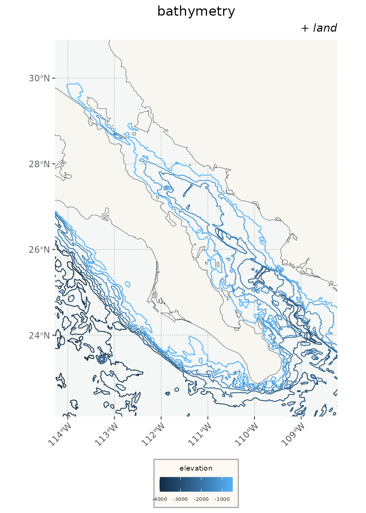
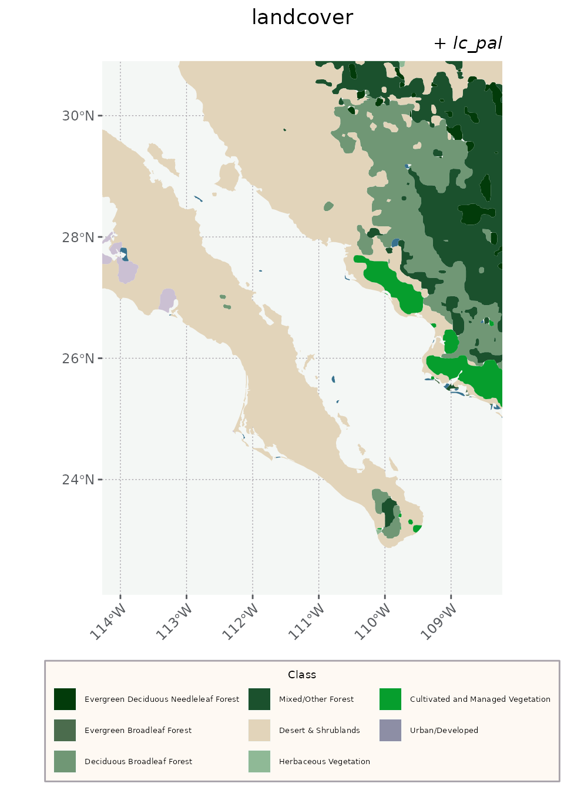
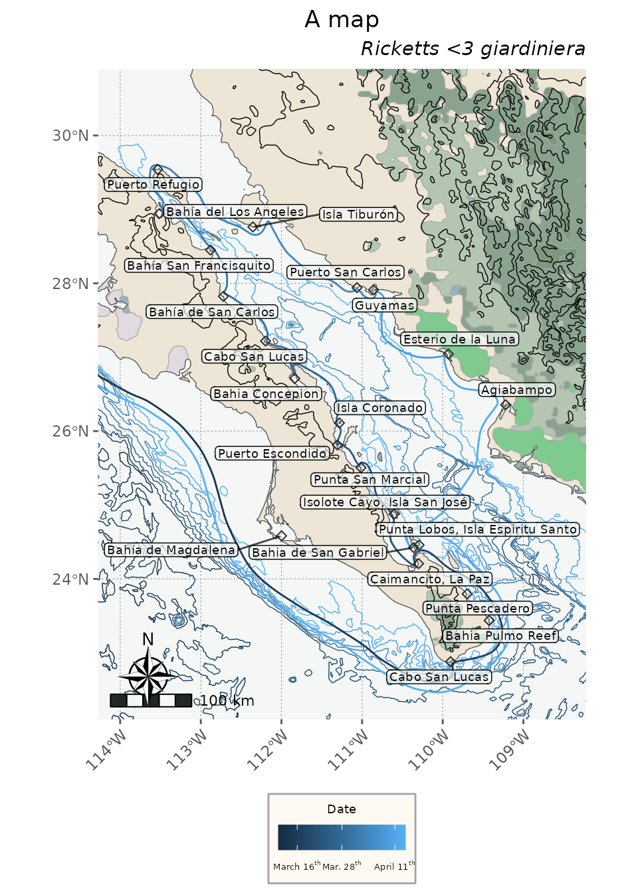

# Exploring the data sets

## Introduction and quick start

`flyer` is available on GitHub, and should make its way to CRAN
eventually. It can be installed via either of the following commands.

``` r

install.packages('devtools')
devtools::install_github('sagesteppe/flyer')

# remotes is very similar and a good alternative for this use case.
install.packages('remotes') 
remotes::install_github('sagesteppe/flyer')
```

To explore the data we’ll load a couple of packages for handling it
(`sf`, `dplyr`), plus a slew of packages for plotting with `ggplot2`
(`ggnewscale`, `ggrepel`, `ggspatial`). It might seem onerous to install
all of these, but I bet once you see what they do you’ll be quite
excited to have them.

``` r

library(flyer)
library(dplyr) # for general data handling
library(sf) # for spatial data

library(ggplot2) # all for plotting the data 
library(ggnewscale) # for mapping multiple variables to an aesthetic. 
library(ggrepel) # for text based labels which move to minimize overlaps. 
library(ggspatial) # compasses and scale bars. 
```

We’ll modify the number of graticules right off the bat. Note that the
`pretty` function does not always return the requested `n`, so we wrap
it in a small helper.

``` r

graticNo <- function(polygon, nx, ny){
  
  bb <- round(st_bbox(polygon), 1)
  if(all(missing(nx) & missing(ny))) {nx <- 5;ny <- 5} else {
    if(all(missing(nx) & ! missing(ny))) {nx <- ny} else {
      if(all(missing(ny) & ! missing(nx))) {ny <- nx}
    } 
  } 

  xbreaks <- pretty(seq(bb[1], bb[3], length.out = nx), nx)
  ybreaks <- pretty(seq(bb[2], bb[4], length.out = ny), ny)
  
  return(
    list(
      x = xbreaks, y = ybreaks
    )
  )
}

brks <- graticNo(polygon = places, nx = 4, ny = 4)

theme_nautical <- function() {
  theme(
    
    aspect.ratio = 4/3,
    text = element_text(family = "Optima"),
    axis.title = element_text(colour = "#222823"),
    axis.text = element_text(colour = "#575A5E", face = "italic"),
    axis.text.x = element_text(hjust= 1, angle=45),
    axis.ticks = element_line(colour = "#575A5E"),
    
    plot.title = element_text(hjust = 0.5),
    plot.subtitle = element_text(hjust = 1, face = 'italic'),
    plot.caption = element_text(color = '#575A5E', face = 'italic'),
    
    panel.background = element_rect(fill = "#F4F7F5"),
    panel.border = element_rect(colour = NA, fill = NA),
    panel.grid.major = element_line(colour = "#A7A2A9", linetype = 'dotted', linewidth = 0.25),
    panel.grid.minor = element_blank(),
    
    legend.background = element_rect(fill = '#FEF9F3', color = '#A7A2A9'),
    legend.text = element_text(size = 5),
    legend.title = element_text(size = 7, hjust = 0.5), 
    legend.title.position = 'top',
    legend.key.size = unit(1,"line"),
    legend.position = "bottom",
    legend.spacing = unit(0.1, "line")
  )
}

bb <-st_bbox(
    c(xmin = -121, xmax = -105, ymin = 19, ymax = 34.5),  crs = st_crs(4326)
)
```

## The data sets

The places visited by the collectors can be loaded via `places`, and the
route they took via `route`. These are really the whole point of the
package — and, spoiler alert, they’re very simple!

But before we pull up `places` and `route`, let’s pull up the `land`
data set so we have some context to plot them on.

#### land

We can read in some polygons depicting land from Natural Earth, via the
`rnaturalearth` package. I love this package’s functionality, even if I
get real forgetful of their API calls (theme argument?).

``` r

head(land)
#> Simple feature collection with 2 features and 1 field
#> Geometry type: MULTIPOLYGON
#> Dimension:     XY
#> Bounding box:  xmin: -120.8977 ymin: 19 xmax: -103 ymax: 35.30912
#> Geodetic CRS:  WGS 84
#> # A tibble: 2 × 2
#>   name                                                                  geometry
#>   <chr>                                                       <MULTIPOLYGON [°]>
#> 1 Mexico                   (((-113.0957 29.0635, -113.0897 29.06302, -113.0823 …
#> 2 United States of America (((-119.3816 34.01122, -119.3923 34.00631, -119.4113…

ggplot() + 
  geom_sf(data = land, fill = '#F8F6F0') + 
  theme_nautical() +
  labs(title = 'land') + 
  coord_sf(xlim = c(bb[1], bb[3]), ylim = c(bb[2], bb[4])) 
```


For playing around with the data today, I don’t want the different
countries drawn separately, so we can union them.

``` r

land <- st_union(land)

m <- ggplot() + 
  geom_sf(data = land, fill = '#F8F6F0') + 
  theme_nautical() + 
  labs(title = 'st_union(land)') + 
  coord_sf(xlim = c(bb[1], bb[3]), ylim = c(bb[2], bb[4])) 

m
```


#### places

``` r

data(places)
head(places)
#> Simple feature collection with 6 features and 6 fields
#> Geometry type: POINT
#> Dimension:     XY
#> Bounding box:  xmin: -117.1852 ymin: 22.88 xmax: -109.4243 ymax: 32.71662
#> Geodetic CRS:  WGS 84
#>                   location_espanol                 location_english collect
#> 1                        San Diego                        San Diego   FALSE
#> 2               Bahía de Magdalena                    Magdalena Bay   FALSE
#> 3                   Cabo San Lucas                   Cape San Lucas    TRUE
#> 4                 Bahia Pulmo Reef                       Cabo Pulmo    TRUE
#> 5                  Punta Pescadero                  Punta Pescadero   FALSE
#> 6 Punta Lobos, Isla Espiritu Santo Punta Lobos, Isla Espiritu Santo    TRUE
#>   real_site date_arrive date_depart                   geometry
#> 1        NA  1940-03-13  1940-03-14 POINT (-117.1852 32.71662)
#> 2        NA  1940-03-16  1940-03-16 POINT (-111.9988 24.58293)
#> 3      TRUE  1940-03-17  1940-03-18     POINT (-109.903 22.88)
#> 4     FALSE  1940-03-19  1940-03-18 POINT (-109.4243 23.43779)
#> 5      TRUE  1940-03-19  1940-03-20  POINT (-109.6971 23.7965)
#> 6      TRUE  1940-03-20  1940-03-20    POINT (-110.293 24.459)

m <- m + 
  geom_sf(data = places)  +
  labs(title = 'places', subtitle = '+ land') + 
  coord_sf(xlim = c(bb[1], bb[3]), ylim = c(bb[2], bb[4])) 
#> Coordinate system already present.
#> ℹ Adding new coordinate system, which will replace the existing one.
m
```


The places seem like they’ll be better treated as text labels — we can
apply them with
[`ggrepel::geom_text_repel`](https://ggrepel.slowkow.com/reference/geom_text_repel.html),
which will nudge them to avoid conflicts with other plot elements.

``` r

m <- m + 
  coord_sf(xlim = c(-118, -106), ylim = c(22, 31)) +
  ggrepel::geom_text_repel(
    data = places,
    aes(label = location_espanol, geometry = geometry),
    stat = "sf_coordinates",
    size = 2.5
    ) + 
  
  # now let's add in our customized graticules too. 
  scale_x_continuous(breaks = brks$x) +
  scale_y_continuous(breaks = brks$y) + 
  theme_nautical() + 
  
  labs(
    x = NULL, y = NULL,
    title = 'geom_text_repel(places)', 
    subtitle = '+ land + places'
    )
#> Coordinate system already present.
#> ℹ Adding new coordinate system, which will replace the existing one.

m
```


Because the package is attached, we can just start using the data — it’s
currently held as a promise. In other words, we don’t need to call
`data(object)` on the data sets; we can use them directly (for example,
by calling `head(object)`). We’ll use this direct approach for the
remainder of the vignette.

#### route

``` r

head(route)
#> Simple feature collection with 6 features and 1 field
#> Geometry type: LINESTRING
#> Dimension:     XY
#> Bounding box:  xmin: -113.4777 ymin: 22.60915 xmax: -109.2605 ymax: 28.99745
#> Geodetic CRS:  WGS 84
#> # A tibble: 6 × 2
#>   destination                                                           geometry
#>   <chr>                                                         <LINESTRING [°]>
#> 1 Agiabampo                    (-109.98 27.00303, -109.9776 26.99705, -109.9767…
#> 2 Amatorajada, San José Island (-110.3415 24.19858, -110.342 24.18917, -110.344…
#> 3 Angeles Bay                  (-112.8615 28.47699, -112.8717 28.48583, -112.88…
#> 4 Cabo Pulmo                   (-109.8743 22.86407, -109.8674 22.86868, -109.85…
#> 5 Caimancito, La Paz           (-110.2735 24.38412, -110.2872 24.38077, -110.30…
#> 6 Cape San Lucas               (-112.5084 24.37574, -112.4991 24.3553, -112.489…

route <- left_join(
  route,
  st_drop_geometry(places),
  by = c('destination' = 'location_english')
  ) |>
  relocate(geometry, .after = last_col())
```

The `route` object itself is pretty minimal, but relevant attributes can
be brought in by joining it to `places`.

``` r

head(route)
#> Simple feature collection with 6 features and 6 fields
#> Geometry type: LINESTRING
#> Dimension:     XY
#> Bounding box:  xmin: -113.4777 ymin: 22.60915 xmax: -109.2605 ymax: 28.99745
#> Geodetic CRS:  WGS 84
#> # A tibble: 6 × 7
#>   destination         location_espanol collect real_site date_arrive date_depart
#>   <chr>               <chr>            <lgl>   <lgl>     <date>      <date>     
#> 1 Agiabampo           Agiabampo        TRUE    FALSE     1940-04-11  1940-04-11 
#> 2 Amatorajada, San J… Isolote Cayo, I… FALSE   TRUE      1940-03-23  1940-03-23 
#> 3 Angeles Bay         Bahía del Los A… TRUE    FALSE     1940-04-01  1940-04-01 
#> 4 Cabo Pulmo          Bahia Pulmo Reef TRUE    FALSE     1940-03-19  1940-03-18 
#> 5 Caimancito, La Paz  Caimancito, La … TRUE    TRUE      1940-03-21  1940-03-22 
#> 6 Cape San Lucas      Cabo San Lucas   TRUE    TRUE      1940-03-17  1940-03-18 
#> # ℹ 1 more variable: geometry <LINESTRING [°]>
```

While some of the data for the start and end of the trip is included —
such as entries near Santa Barbara and the departure from and return to
Monterey — most of it focuses on the Gulf of California. Basically,
including too much data would make the package too cumbersome to fit on
CRAN. In my mind, the maximum useful map area reaches San Diego in the
north.

``` r

date_scale <- as.Date(quantile(as.numeric(route$date_arrive), na.rm = T, probs = c(0.1, 0.5, 0.9)))
dates <- c(
  expression(paste("March ", 16^th)), 
  expression(paste("Mar. ", 28^th)), 
  expression(paste("April ", 11^th))
  )
```

``` r

bb <- st_bbox(
  c(xmin = -114, xmax = -108.5, ymin = 22.5, ymax = 30.5),
  crs = st_crs(4326)
)

# we have to crop the places data set or ggrepel will move places outside the
# coord_sf down into the plot anyways

places <- st_crop(places, bb)

m <- ggplot()  +
  geom_sf(data = land, fill = '#F8F6F0') + 
  theme_nautical() +
  geom_sf(data = route, aes(color = date_arrive)) +  
 # scale_color_date() +  # alteratively just use this and default labels. 
  scale_color_continuous('Date',
      breaks = date_scale,
      labels = dates
      )  + 
  coord_sf(xlim = c(bb[1], bb[3]), ylim = c(bb[2], bb[4])) + 
  
  labs(
    title = 'route', 
    subtitle = '+ land')

  
m
```


Now let’s add some topography to make the land seem more natural. We’ll
also ignore the administrative borders.

Note that we’re going back to the drawing board to control the order in
which layers are added to the map. We’ll still overwrite the variable
`m`.

``` r


m <- ggplot() + 
  geom_sf(data = land, fill = '#F8F6F0') + 
  geom_sf(data = topography, lwd = 0.1) + 
  geom_sf(data = route, aes(color = date_arrive)) +
  scale_color_date('Date') + 
  coord_sf(xlim = c(bb[1], bb[3]), ylim = c(bb[2], bb[4])) + 

  # we are going to shift to adding 'backing' to the labels this makes them easier to read
  ggrepel::geom_label_repel(
    data = places,
    aes(label = location_espanol, geometry = geometry),
    stat = "sf_coordinates",
    alpha = 0.7, # make the backing more transparent
    label.size = NA, # remove the backing borders
    label.padding = 0.1, # reduce space between label borders and text
    size = 2.5 # make the font smaller. 
    ) + 
    scale_color_continuous('Date',
      breaks = date_scale,
      labels = dates
      ) + 
  
  # now let's add in our customized graticules too. 
  scale_x_continuous(breaks = brks$x) +
  scale_y_continuous(breaks = brks$y) + 
  theme_nautical() + 
  labs(
    x = NULL, y = NULL,
    title = 'elevation', 
    subtitle = '+ route + places') 
#> Scale for colour is already present.
#> Adding another scale for colour, which will replace the existing scale.

m
#> Warning in st_point_on_surface.sfc(sf::st_zm(x)): st_point_on_surface may not
#> give correct results for longitude/latitude data
```


We can plot the bathymetry data like this.

``` r

ggplot() + 
  geom_sf(data = land, fill = '#F8F6F0') + 
  geom_sf(data = bathymetry, aes(color = elevation), lwd = 0.4)  +
  theme_nautical() + 
  coord_sf(xlim = c(bb[1], bb[3]), ylim = c(bb[2], bb[4])) + 
  labs(title = 'bathymetry', subtitle = '+ land')
```

 And
obviously we could rename it to something like depth :)

Alternatively, the same scale can be used for topography and bathymetry
together, as shown below. I’ll use a divergent scale, which makes sense
to me here. Another *very* cool interpretation would be a continuous
scale that counts everything from 0 at 4,300 feet and adds the
difference to the `topography` data set. Or — much to my liking — we
could convert the bathymetry polylines to polygons and use them to color
the whole ocean, with darker areas as deeper hues of blue.

``` r

head(bathymetry)
#> Simple feature collection with 6 features and 1 field
#> Geometry type: LINESTRING
#> Dimension:     XY
#> Bounding box:  xmin: -121 ymin: 19.59502 xmax: -117.0035 ymax: 31.94066
#> Geodetic CRS:  WGS 84
#>     elevation                       geometry
#> 1       -4000 LINESTRING (-121 31.91037, ...
#> 1.1     -4000 LINESTRING (-121 29.55895, ...
#> 1.2     -4000 LINESTRING (-121 26.51376, ...
#> 1.3     -4000 LINESTRING (-121 27.20785, ...
#> 1.4     -4000 LINESTRING (-121 21.41284, ...
#> 1.5     -4000 LINESTRING (-121 21.86726, ...

ggplot() + 
  geom_sf(data = land, fill = '#F8F6F0') + 
  geom_sf(data = bathymetry, aes(color = elevation), lwd = 0.4) + 
  geom_sf(data = topography, aes(color = elevation), lwd = 0.4) + 
  scale_color_distiller('Elevation', palette = "Spectral") +
  
  ggnewscale::new_scale_color() + 

  geom_sf(data = places) +  
  geom_sf(data = route, aes(color = date_arrive)) +
  labs(title = 'topography', subtitle = '+ land + bathymetry')+
  scale_color_continuous('Date',
      breaks = date_scale,
      labels = dates
      ) + 
  theme_nautical() + 
  coord_sf(xlim = c(bb[1], bb[3]), ylim = c(bb[2], bb[4]))
```


### Tangential data

While some of the earlier data sets are loosely related to the book,
these next two aren’t related at all — but they can be useful for
cartography.

A simple landcover classification data set is available as `landcover`.
We also include some quick colors to help with mapping these classes.

``` r

ggplot() + 
  geom_sf(data = landcover, aes(fill = class), color = NA) + 
  scale_fill_manual('Class', values = lc_pal, breaks = names(lc_pal[c(1:8, 9)])) + 
  theme_nautical() + 
  labs(title = 'landcover', subtitle = '+ lc_pal') + 
  guides(fill = guide_legend(nrow = 3)) + 
  coord_sf(xlim = c(bb[1], bb[3]), ylim = c(bb[2], bb[4]))
```



Information on protected areas of Mexico is also included.

``` r

protected <- st_crop(protected, bb)

ggplot() + 
  geom_sf(data = land, fill = '#F8F6F0') + 
  geom_sf(
    data = protected, 
    aes(fill = reserve_type), 
    alpha = 0.4) + 
  scale_fill_manual('Reserve', values = c('Terrestrial' = '#417B5A', 'Marine' = '#DA7635')) + 
  ggrepel::geom_text_repel(
    data = protected,
    aes(label = name, geometry = geometry),
    stat = "sf_coordinates",
    size = 2.5
    ) + 
  labs(x = NULL, y = NULL, title = 'protected', subtitle = '+ land') + 

  theme_nautical()  + 
  coord_sf(xlim = c(bb[1], bb[3]), ylim = c(bb[2], bb[4]))
```


## Putting it all together

We can make an OK map using some of the details below.

``` r

ggplot() + 
  
  # the stage
  geom_sf(data = landcover, aes(fill = class)) + 
  scale_fill_manual('Class', values = lc_pal) + 
  geom_sf(data = land, fill = '#F8F6F0', alpha = 0.5) +  # helps to dull the landcover for this map. 
  guides(fill="none") + 

  geom_sf(data = bathymetry, aes(color = elevation), lwd = 0.25) + 
  geom_sf(data = topography,  aes(color = elevation), lwd = 0.25, color = 'black') + 
#  scale_color_distiller('Elevation', palette = "Spectral") +
  guides(color='none') + 
  ggnewscale::new_scale_colour() + 
  
  # the story 
  geom_sf(data = route, aes(color = date_arrive)) +
    scale_color_continuous('Date',
      breaks = date_scale,
      labels = dates
      ) + 

  geom_sf(data = places, shape = 5, size = 1.5, color = '#222823') +   
  ggrepel::geom_label_repel(
    data = places,
    aes(label = location_espanol, geometry = geometry),
    stat = "sf_coordinates",
    alpha = 0.7, # make the backing more transparent
    label.size = NA, # remove the backing borders
    label.padding = 0.1, # reduce space between label borders and text
    size = 2.5,# make the font smaller. 
    fill = '#F4F7F5'
    ) +
  
  # the ambiance.  
  coord_sf(xlim = c(bb[1], bb[3]), ylim = c(bb[2], bb[4]), crs = 4326) + 
  annotation_scale(bar_cols = c('#222823', '#F4F7F5'))  + 
  annotation_north_arrow(which_north = "true", style = north_arrow_nautical) + 
  theme_nautical() +
  labs(title = 'A map', subtitle = 'Ricketts <3 giardiniera', x = NULL, y = NULL)
#> Warning in st_point_on_surface.sfc(sf::st_zm(x)): st_point_on_surface may not
#> give correct results for longitude/latitude data
```



``` r

rm(graticNo, brks, theme_nautical, route, places, bb, landcover, lc_pal, land,
   protected, bathymetry, topography)
```
